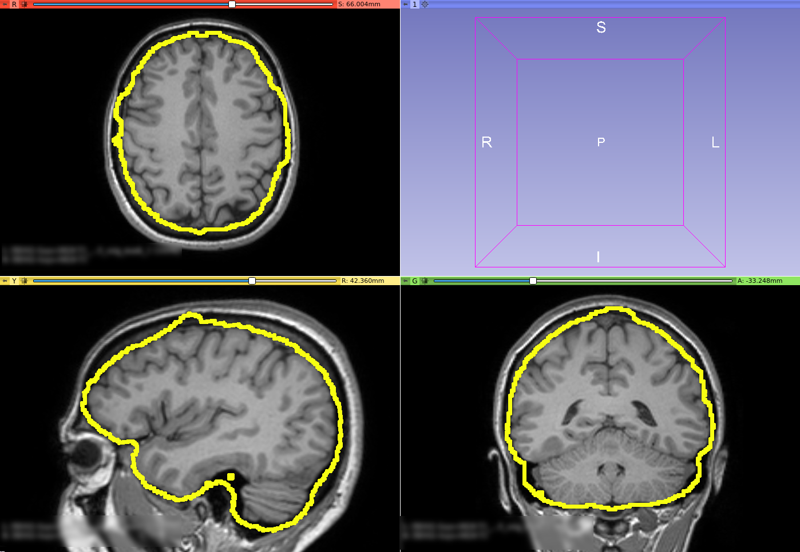
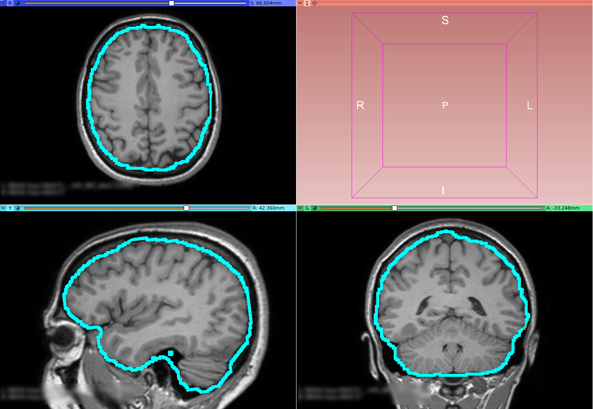
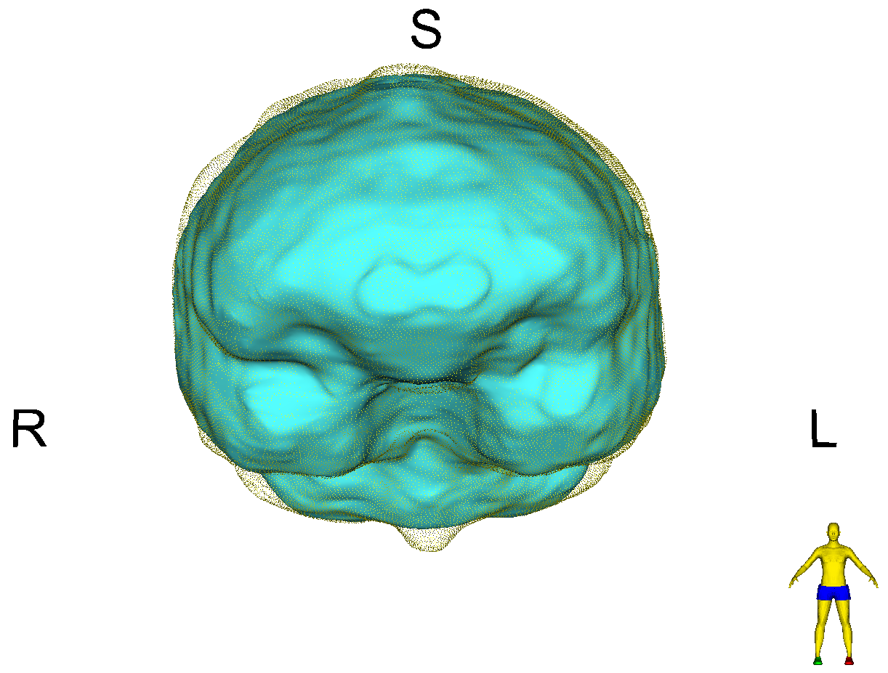
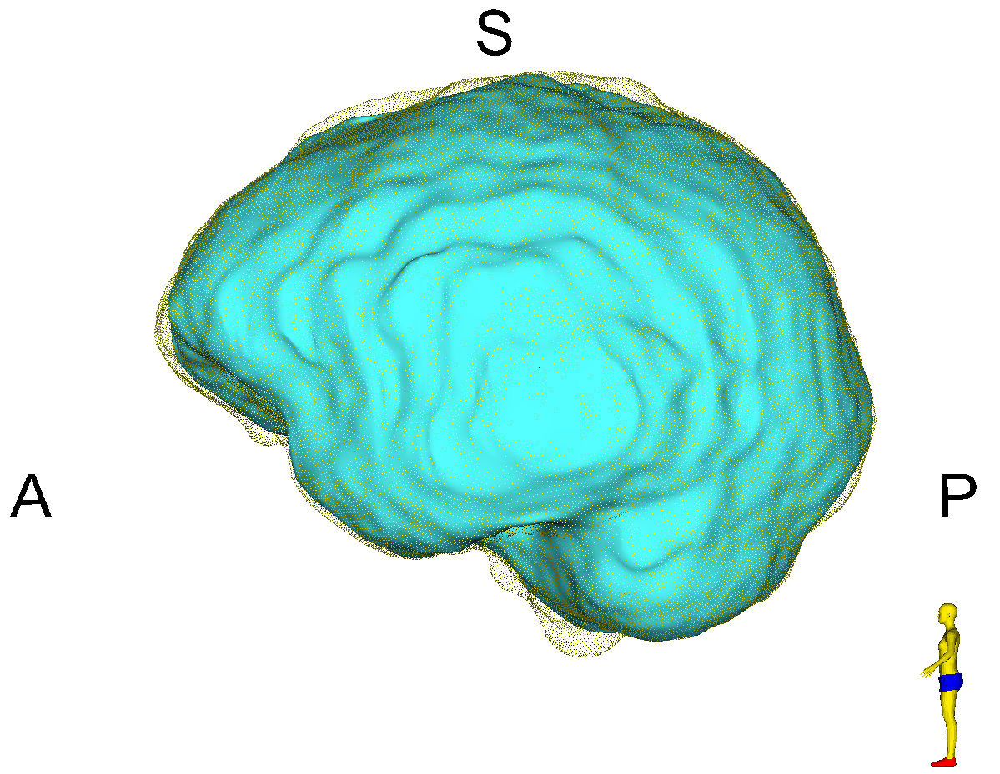
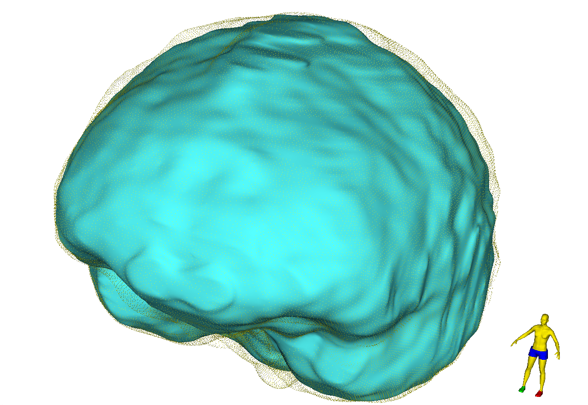

# Brain Volume Refinement

{ width="150" .center}

Welcome to the Brain Volume Refinement Slicer Extension!

The Brain Volume Refinement (`BVeR`) extension is designed to assist neuroscience studies. The `BVeR` algorithm is suitable for a broad use of healthy brain structural MRI images, e.g. T1w and T2w, offering broad application in many large data analyses. The main contribution of the proposed method is related to the reduction of manual interference in the brain volume refinement after an automatic skull stripping procedure been performed, helping to reduce human errors and processing time.

## Use Cases

Most frequently used for these scenarios:

- **Use Case 1:** Cortical thickness surface delineation.

    - When dealing with grey-matter overestimate due to badly brain extraction step.

- **Use Case 2:** Brain atrophy

    - Assist in the total brain volume estimate also reducing the non-brain tissues belonging outside the grey-matter tissue frontier.

{ width="650" .center}

T1 weighted MRI Image with FreeSurfer original brain mask overlay (only the out surface is represented)

{ width="650" .center}

Same T1 weighted MRI Image but with BVeR correction mask overlay (using the previous FreeSurfer input)

## Modules

### BVeR

This module offers an alternative to manual correction of brain volumes. Even though the BVeR method does not provide a fully brain extraction algorithm, it can be helpful as a ad hoc image processing step in which increase the quality of well-known brain extraction algorithm in the literature. Any brain extracting frameworks can be refined with this method, e.g. FSL-BET, FreeSurfer, BEasT, 3DSkullStrip, ROBEX, OptiBET and many others.

The following image samples represents the brain volume correction that was overestimated by traditional brain masking algorithms.

!!! warning
    The `BVeR` method is designed to correct oversegmentation masking. Therefore, for brain segmentation issues related to region cropping (underestimate) this method is not recommended.

{ width="650" .center}
{ width="650" .center}
{ width="650" .center}

## Cite this tool

We hope that the `BVeR` can be helpful for your applications. If possible, recall to cite at least one of the following publications:

* da Silva Senra Filho, A.C., Simozo, F.H. & Murta Junior, L.O. Brain volume refinement (BVeR): automatic correction tool as an alternative to manual intervention on brain segmentation. Res. Biomed. Eng. 37, 631–640 (2021).doi: [10.1007/s42600-021-00168-x](https://doi.org/10.1007/s42600-021-00168-x)

## License

This project is under MIT license and following details are given at the [LICENSE](https://github.com/CSIM-Toolkits/SlicerDiffusionComplexityMap/blob/main/LICENSE) file in the project repository.